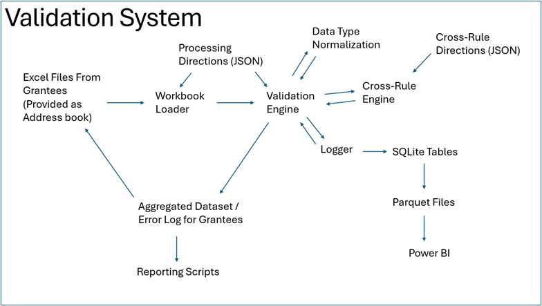

.. ows_validation_engine documentation master file, created by
   sphinx-quickstart on Mon Dec 15 10:46:21 2025.
   You can adapt this file completely to your liking, but it should at least
   contain the root `toctree` directive.

OWS Validation Documentation
===================================

These pages provide documentation for the various methods and classes that support the OWS validation process, 
which aims to quickly transform disparate excel spreadsheets into a clean, usable dataset while also recording errors, 
and producing an error log that can easily be used by data owners to remedy issues. 

The implementation as it is presented here also includes SQL logging functionality to a SQLite table, connecting separate runs 
to allow for fast cross-grant comparison and assessments of state change (over time) for a given grant. If you aren't interested
in the SQL logging and just want the data consolidation and error log creation, this can be toggled when the validation engine 
is called. 

The system itself is dataset agnostic and could be re-implemented to manage data collection in any context where different 
organizations are submitting formulaically structured datasets. 

Certain critical objects (like the file directory) are omitted here for security reasons, but the code is otherwise intact.

The general architecture of the project is laid out below: 

Core Engine
-----------
.. toctree::
   :maxdepth: 2
   :caption: Core Engine 

   cc_validation_engine
   cc_validation_workbook_loader
   cc_workbook_definitions
   cc_validation_column_types

Cross-Rules
-----------
.. toctree::
   :maxdepth: 2
   :caption: Cross-Rules

   cc_cross_rule_engine
   cc_cross_rule_classes
   cc_validation_cross_rule_sets 

Logging
-----------
.. toctree::
   :maxdepth: 2
   :caption: SQL Logging

   cc_key_creator
   validation_db_logger